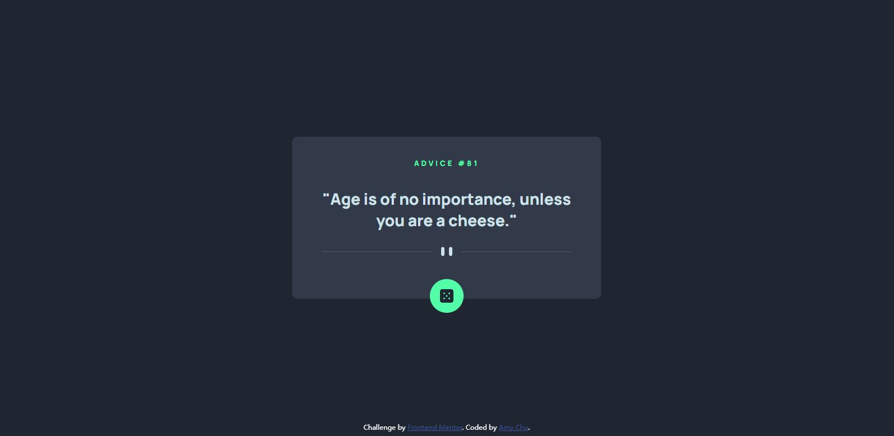

# Frontend Mentor - Advice generator app solution

This is a solution to the [Advice generator app challenge on Frontend Mentor](https://www.frontendmentor.io/challenges/advice-generator-app-QdUG-13db). Frontend Mentor challenges help you improve your coding skills by building realistic projects.

## Table of contents

- [Overview](#overview)
  - [The challenge](#the-challenge)
  - [Screenshot](#screenshot)
  - [Links](#links)
- [My process](#my-process)
  - [Built with](#built-with)
  - [What I learned](#what-i-learned)
  - [Continued development](#continued-development)
- [Author](#author)


## Overview

### The challenge

Users should be able to:

- View the optimal layout for the app depending on their device's screen size
- See hover states for all interactive elements on the page
- Generate a new piece of advice by clicking the dice icon

### Screenshot



### Links

- Solution URL: [Solution URL](https://github.com/MightyKale/Advice-generator-app)
- Live Site URL: [Live Site](https://mightykale.github.io/Advice-generator-app/)

## My process
Started with creating containers in HTML, spent a l-------o-------n-------g time working on (and learning) CSS, especially positioning elements, and surprisingly the actual script.js didn't take longer than 20 minutes.  

### Built with

- HTML, CSS and JS

### What I learned
Like I said earlier, I've learned a lot on positioning elements and how to center them. I can't really distinguish between align-items and text-align, and also had trouble using positions (fix, relative, absolute, inline, block etc.). To be honest, I still didn't get a clear understanding of those, but I am starting to get a sense of how and when to use them. 

- Something specific that I learned is to center an item with the code below:
```css
.container {
  left: 50%;
  top: 50%;
  transform:translate(-50%, -50%);
}
```
- another thing I learned is to build responsive div without using media query, but just simply set a standard width with an actual number and a max-width of a percentage.


### Continued development

I will continue to do more challenges and hopefully I can speed up my CSS coding. 
I also want to practice more on positioning as well. 

## Author

- Website - [Amy Chu](www.linkedin.com/in/amy-chu-xiaoxiao)

